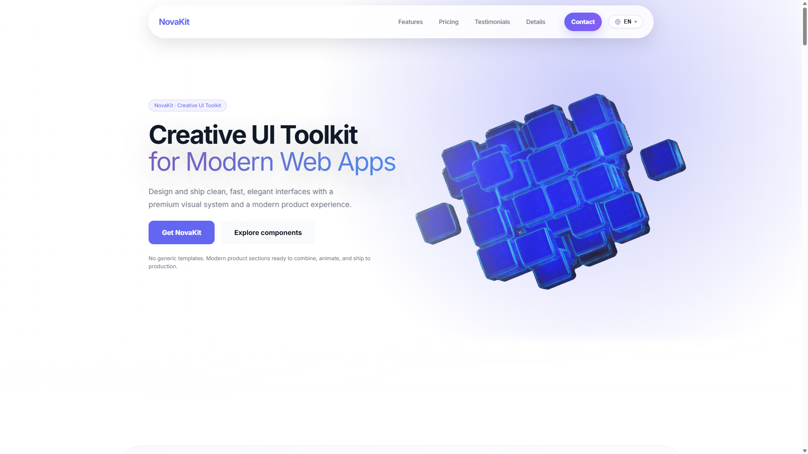
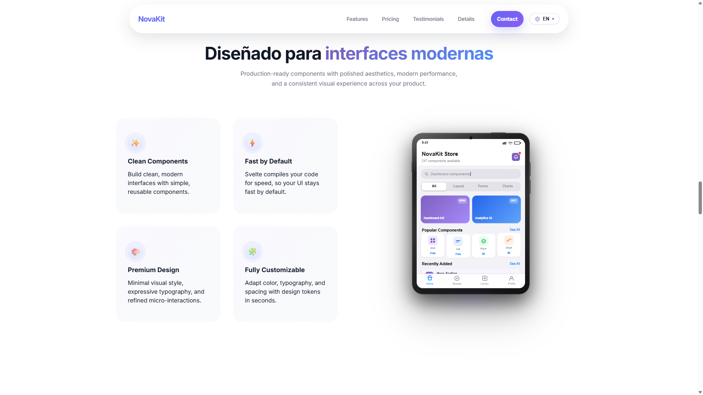
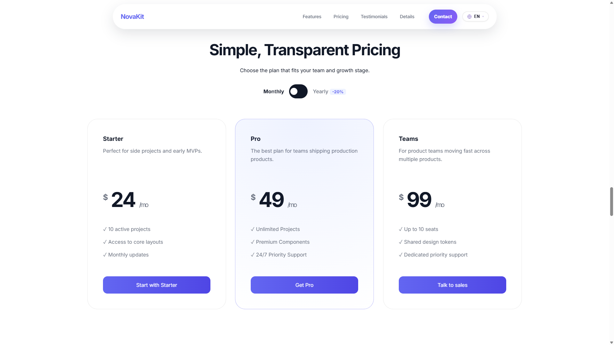
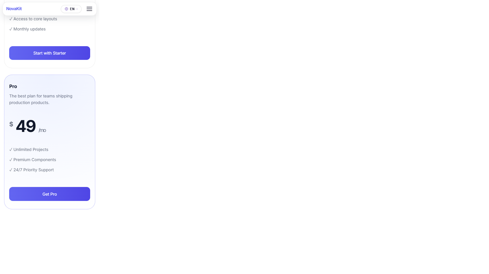
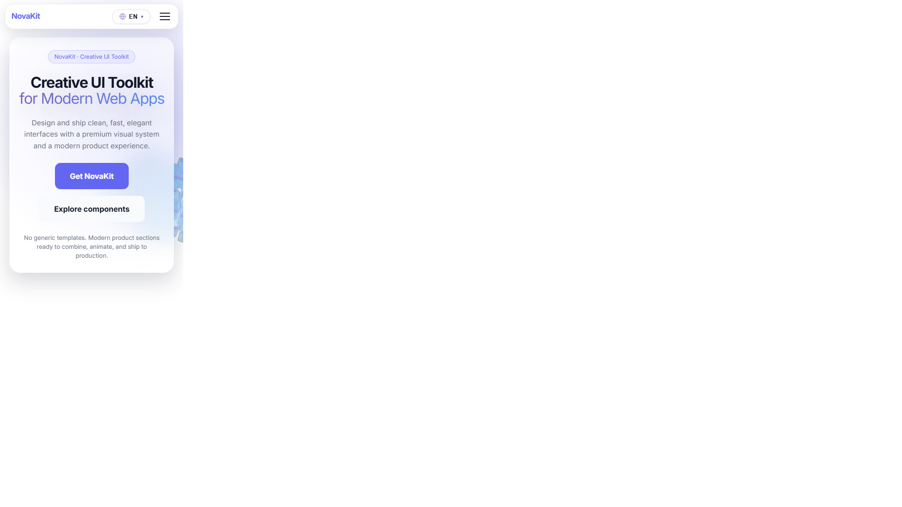

# NovaKit - Portfolio técnico

[](https://novakit.vercel.app/)
[](https://svelte.dev/)
[](https://kit.svelte.dev/)
[](https://www.typescriptlang.org/)
[](https://novakit.vercel.app/)

Landing de **portfolio** que simula el sitio de un producto ficticio (_NovaKit_). El objetivo no es vender un toolkit real, sino mostrar capacidades de frontend: diseño de producto, animaciones, i18n, rendimiento y despliegue en producción.

**Demo:** [https://novakit.vercel.app/](https://novakit.vercel.app/)

---

## Qué demuestra este proyecto

| Área            | Detalle                                                                  |
| --------------- | ------------------------------------------------------------------------ |
| **Framework**   | Svelte 5 (runes) + SvelteKit 2 + TypeScript                              |
| **UI**          | Landing multipágina en una sola ruta, secciones modulares, scroll reveal |
| **i18n**        | Español / inglés con JSON estático y persistencia en `localStorage`      |
| **3D / motion** | Hero con iframe Spline, microinteracciones CSS, estados reactivos        |
| **Calidad**     | ESLint, Prettier, `svelte-check`                                         |
| **Producción**  | Vercel Analytics, Speed Insights, SEO básico (OG, `robots.txt`)          |

---

## Capturas

Vista previa de la [demo en vivo](https://novakit.vercel.app/). Más imágenes en [`docs/screenshots/`](./docs/screenshots/).

### Hero (escritorio)



### Features y mockup móvil



### Pricing

| Escritorio                                                      | Móvil                                                     |
| --------------------------------------------------------------- | --------------------------------------------------------- |
|  |  |

### Hero (móvil)



---

## Stack

- [Svelte 5](https://svelte.dev/) — `$state`, `$derived`, componentes con runes
- [SvelteKit](https://kit.svelte.dev/) — routing, SSR/CSR, adapter-auto
- [Vite 7](https://vite.dev/)
- [TypeScript](https://www.typescriptlang.org/)
- [Vercel](https://vercel.com/) — hosting, analytics y métricas de rendimiento

---

## Estructura del repo

```
src/
├── lib/
│   ├── components/   # Secciones de la landing (Hero, Pricing, FAQ, …)
│   ├── i18n/         # Traducciones en/en.json
│   └── reveal.ts     # Acción Svelte para animaciones al scroll
├── routes/
│   ├── +layout.svelte
│   ├── +layout.ts    # Vercel Analytics
│   └── +page.svelte
static/               # Favicon, OG image, logos, robots.txt
```

La carpeta `.agents/skills/` contiene skills de Cursor instaladas con [autoskills](https://www.npmjs.com/package/autoskills); son opcionales para desarrollo local y no afectan al build.

---

## Requisitos

- **Node.js** 20+ (recomendado 22 LTS)
- **npm** 10+

---

## Desarrollo local

```bash
git clone https://github.com/moisesvalero/novakit.git
cd novakit
npm install
npm run dev
```

Abre [http://localhost:5173](http://localhost:5173).

### Scripts útiles

| Comando           | Descripción                            |
| ----------------- | -------------------------------------- |
| `npm run dev`     | Servidor de desarrollo                 |
| `npm run build`   | Build de producción                    |
| `npm run preview` | Vista previa del build                 |
| `npm run check`   | Comprobación de tipos Svelte/TS        |
| `npm run lint`    | Prettier + ESLint                      |
| `npm run format`  | Formatear con Prettier                 |
| `npm run skills`  | Actualizar skills de Cursor (opcional) |

No se necesitan variables de entorno para ejecutar el proyecto en local.

---

## Despliegue

Pensado para [Vercel](https://vercel.com/) con `@sveltejs/adapter-auto`:

1. Importa el repositorio en Vercel.
2. Framework preset: **SvelteKit**.
3. Build: `npm run build` · Output: gestionado por el adapter.

La demo oficial está en **novakit.vercel.app**.

---

## Seguridad y privacidad

- Sitio **estático**: sin API propia, base de datos ni autenticación.
- Los textos con HTML (`{@html}`) provienen solo de archivos JSON versionados en el repo (copy de marketing), no de input de usuario.
- Servicios de terceros: iframe [Spline](https://spline.design/) en el hero, [Vercel Analytics](https://vercel.com/docs/analytics) y [Speed Insights](https://vercel.com/docs/speed-insights).

Más detalle en [SECURITY.md](./SECURITY.md).

---

## Autor

**[Moisés Valero](https://moisesvalero.es)** — portfolio y contacto

- [GitHub](https://github.com/moisesvalero)
- [LinkedIn](https://www.linkedin.com/in/moisesvalero/)

---

## Licencia

[PolyForm Noncommercial 1.0.0](./LICENSE) — uso no comercial; el nombre _NovaKit_ en este contexto es una marca ficticia de demo.
